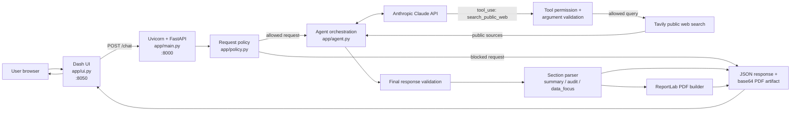

# Research Agent Design

## 1. Purpose and scope

Research Agent is a small, policy-constrained research assistant. A user
submits a research question through a Dash browser UI. The UI sends the request
to a FastAPI service, which coordinates Claude, an explicitly registered
Tavily public-web search tool, deterministic validation, response section
parsing, and PDF report generation.

The application is designed for public-source research and experiment-design
support. It does not claim that an experiment was performed, does not access
private data, and does not provide arbitrary network access to the model. The
result is advisory: users must review the evidence, citations, uncertainty,
and recommendations before relying on them.

The included Docker setup is intended for reproducible local development,
demonstrations, and trusted internal use. It is not an authentication,
secrets-management, TLS, or general internet-facing deployment solution.

## 2. Architecture

The repository has two user-facing processes when run normally:

- **Uvicorn/FastAPI** (`app.main:app`) listens on port `8000` and owns the API,
  policy gate, agent call, response validation, section parsing, and PDF
  generation.
- **Dash** (`python -m app.ui`) listens on port `8050` and owns the browser
  interface. It calls the FastAPI `/chat` endpoint server-side and renders the
  response fields in separate tabs.

The Docker image starts both processes in one container. For local
 development, they can be started in separate terminals. The Dash process uses
 `BACKEND_URL` to locate FastAPI; the container defaults this to
 `http://127.0.0.1:8000` because both services share the container network.



The agent loop is bounded. Each request permits at most five model iterations
and two public search calls. A model-requested tool call must pass application
policy, argument validation, and the registered-tool lookup before execution.
The model cannot request an arbitrary URL or an unregistered tool.

## 3. Request and response lifecycle

### Request path

1. The user enters a question in the Dash textarea and selects **Run
   research**.
2. Dash sends `{"message": "..."}` to `POST /chat`.
3. FastAPI validates the request with Pydantic and applies
   `check_user_request()`.
4. The request policy rejects empty input, private or confidential-data
   requests, and common attempts to override restrictions.
5. `Agent.run()` combines the user message with `reference_context.md` and
   sends it to Claude with `SYSTEM_PROMPT` and the available tool definition.
6. If Claude requests `search_public_web`, the application checks the tool
   name and arguments before calling Tavily.
7. Search results are returned to the agent as structured tool results. Claude
   can use them to produce the final answer.
8. The final text is checked by `validate_final_response()`. The application
   also requires the three exact section headings for a structured answer.
9. FastAPI parses the headings into three independent fields:
   `summary`, `audit`, and `data_focus`.
10. ReportLab creates a PDF from those fields. The PDF is returned as a
    base64-encoded `download` artifact.
11. Dash renders the three fields in the Summary, Technical / Audit, and Data
    Focus tabs and exposes the PDF as a download link.

If the model fails, exceeds the search budget, or cannot produce a validated
answer, the API returns a controlled failure message rather than treating an
unvalidated response as research evidence.

### Response contract

`ChatResponse` contains:

- `answer`: the summary text, retained for compatibility with older callers.
- `summary`: the concise executive-level result.
- `audit`: evidence quality, limitations, tradeoffs, and technical reasoning.
- `data_focus`: source-backed raw data, tables, CSV when available, and chart
  suggestions.
- `download`: an optional PDF artifact with filename, MIME type, encoding, and
  base64 content.

The UI reads `summary`, `audit`, and `data_focus` independently. An empty
structured section remains empty rather than being copied into another tab.

## 4. Instructions and control boundaries

The application intentionally has multiple instruction layers with different
authority.

### Hard application policy

`app/policy.py` is the non-model policy boundary. It defines the public-source
requirement, forbids private data and external actions, requires citations,
and forbids fabricated evidence. It also checks user input and authorizes only
the `search_public_web` tool. User messages and model output cannot override
these checks.

`validate_tool_arguments()` in `app/validation.py` adds deterministic checks
for the search query, including non-empty input, a 500-character limit, and
private-data patterns. These checks happen before Tavily is called.

### System prompt

`SYSTEM_PROMPT` in `app/agent.py` describes the assistant role and expected
answer quality. It tells Claude to distinguish facts from reasoning, cite
public sources, avoid fabricated results, return the exact three headings,
and put evidence-derived data in the Data Focus section. It also tells Claude
to treat experiment designs as suggestions rather than completed experiments.

The system prompt improves model behavior but is not the security boundary.
The code-level policy and validators remain authoritative.

### Reference context

`app/reference_context.md` contains domain and formatting guidance, such as
ranking criteria, section requirements, source citation expectations, and
handling of missing evidence. The agent appends this content to the user
prompt as background context. It explicitly does not override the system
prompt or application policy.

This separation is intentional: product behavior can be adjusted in the
reference context, while hard restrictions remain in code.

## 5. Customization and operating considerations

Common customization points are:

- **Research behavior:** edit `SYSTEM_PROMPT` and
  `app/reference_context.md`.
- **Hard restrictions:** edit `POLICY`, private-data patterns, and tool
  permission checks in `app/policy.py`.
- **Tool behavior:** add or change tools in `app/tools.py`, then update the
  permission and argument-validation paths.
- **Output requirements:** update `validate_final_response()` and the section
  parser together if the response contract changes.
- **UI:** edit `app/ui.py`, especially the Dash callback and tab rendering.
- **PDF format:** edit `_markdown_flowables()` and `_build_pdf_report()` in
  `app/main.py`.
- **Runtime configuration:** use `.env.example` as the source of documented
  environment variables. Keep real `.env` files out of source control and
  outside the Docker image.

Important runtime assumptions:

- A real run requires `ANTHROPIC_API_KEY`; public web search requires
  `TAVILY_API_KEY`.
- `USE_MOCK_ANTHROPIC=true` is for tests and local development only.
- Tavily requests have a 20-second timeout. The Dash-to-FastAPI request
  timeout defaults to 120 seconds.
- CORS currently permits only `http://localhost:8050`, matching local use.
- Dash currently starts with debug mode enabled when run as a module; review
  this before exposing the UI beyond a trusted environment.
- The generated PDF is held in memory and embedded in the JSON response, so
  unusually large reports increase response size and memory use.

## 6. Testing strategy

The test suite covers policy decisions, tool behavior, validation, environment
loading, API response shaping, UI rendering, section isolation, and PDF
creation. PDF tests also verify that Markdown links inside Data Focus tables
become ReportLab hyperlinks rather than literal `[Name](url)` text.

Run the suite from the repository root with:

```powershell
python -m pytest
```

The most important architectural invariant is that every factual answer must
remain bounded by public evidence, explicit source citations, deterministic
policy checks, and the separate response sections expected by the UI and PDF
builder.
